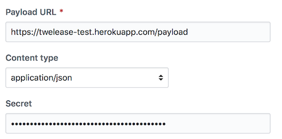
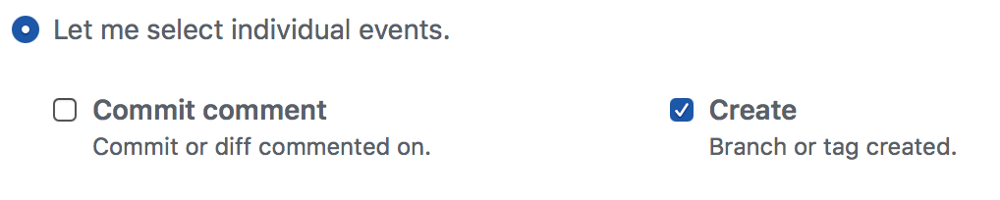

[](https://circleci.com/gh/ashfurrow/twelease)

Twelease
========

Twelease is a small Express server that received GitHub webhooks and tweets about new tags pushed to the repo.

Setup
-----

Setting up Twelease takes about 5 minutes. While logged in with the Twitter account you want the tweets to be sent from, you need to [register a new Twitter application](https://apps.twitter.com/app/new) to receive OAuth credentials. Make sure to generate an access token and secret for your account. With those four tokens in hand, next we'll deploy the server.

I recommend using Heroku. Smash that deploy button!

[](https://heroku.com/deploy)

Note that Heroku creates a `WEBHOOK_SECRET_TOKEN`. Copy that – we'll need it to set up our GitHub webhook. You'll be prompted to enter in the tokens you got from Twitter, too.

For the tweet template, we use Mustache. Make sure to use triple-braces to avoid HTML escaping, and if you want a newline you need to actually press the return key (and *not* include `\n`). There is a default provided for you, and you can customize it later in the Heroku environment variables settings.

Got to the Settings page for whatever repo you want to add this integration to. Select the "Webhooks" section and click "Add Webhook". *Important*: for content type, select `application/json`. Paste in the secret from Heroku, as well as the Heroku URL. The URL should end with `/payload`, so if your Heroku URL is `http://example.herokuapp.com/`, then enter `http://example.herokuapp.com/payload` into GitHub.



Select "Let me select individual events" and select only the "create" event. This will save you Dyno hours on Heroku.



Finally, hit the green "Add webhook" button at the bottom of the screen.

Great job! And because the repo name is passed into the Mustache template, you can repeat the webhook setup process on as many repos as you like, using the same `WEBHOOK_SECRET_TOKEN`.

Developing
----------

This is a NodeJS Express server written in Typescript.

```sh
git clone https://github.com/ashfurrow/twelease.git
cd twelease
yarn install
```

If you have questions, [open an issue](https://github.com/ashfurrow/twelease/issues/new)!
